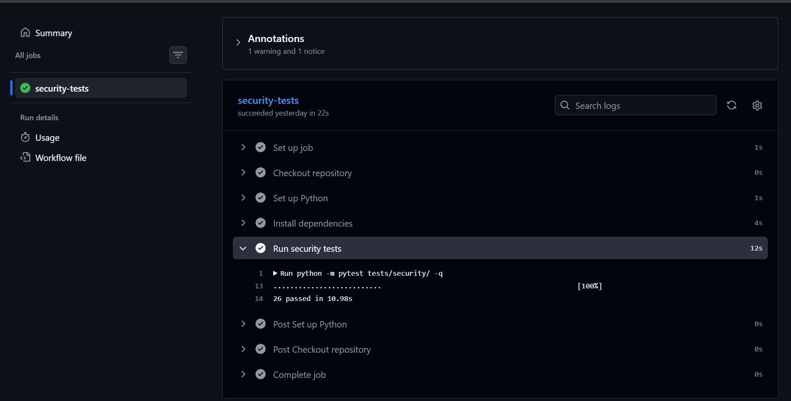

# SecureCart Security Test Results

## 1. Project Overview

**Project:** SecureCart – OWASP Web and API Security Assessment  
**Application:** Flask REST API with SQLite database  
**Testing framework:** Pytest  
**CI platform:** GitHub Actions  
**Assessment date:** 9 October 2026

# SecureCart Security Testing Report

## 1. Introduction

As part of my cybersecurity capstone project, I developed and tested SecureCart, a web application built using Python, Flask, and SQLite.

My main objective was to understand how security vulnerabilities affect web applications and APIs, identify weaknesses in my application, and implement appropriate security controls.

I also wanted to make sure that the vulnerabilities I fixed would not be introduced again when I made changes to the application.

To achieve this, I used Pytest for automated security testing and GitHub Actions for Continuous Integration (CI).

## 2. Objectives of My Security Testing

During this project, I focused on the following objectives:

- Testing the authentication system to identify login-related weaknesses.
- Checking whether customers could access administrator functions.
- Testing order processing and stock validation.
- Examining coupon handling and payment notifications.
- Testing how the application handles different input values.
- Fixing identified security weaknesses.
- Writing automated tests to verify the fixes.
- Configuring GitHub Actions to run my security tests automatically.

## 3. How I Carried Out the Security Testing

I started by reviewing the different functions and API endpoints in my SecureCart application.

I examined the authentication system, user roles, product management, order processing, coupon handling, and payment notifications.

During my assessment, I identified eight security findings, which I documented separately in `docs/security-findings.md`.

After identifying the weaknesses, I worked on fixing them and created automated tests to check whether the security controls behaved as expected.

I used Pytest to write and execute the tests.

To prevent the tests from affecting my main application database, I configured a temporary SQLite database using the `tests/conftest.py` file.

This allowed me to run my tests using separate sample data.

## 4. Running My Security Tests Locally

After writing my automated security tests, I opened the terminal in VS Code and ran:

```powershell
python -m pytest tests/security/ -q
```

At first, I encountered some errors while setting up the testing environment.

One issue occurred because my Flask application required the `SECRET_KEY` environment variable.

I resolved this by generating temporary environment variables for testing.

I also corrected a duplicate Pytest fixture that prevented some authorization tests from using the properly initialized test database.

After making these corrections, I ran the tests again.

My final local test result was:

```text
.......................... [100%]
26 passed in 47.60s
```

This confirmed that all 26 automated security tests passed on my computer.

## 5. Configuring GitHub Actions

After successfully running the tests locally, I wanted to automate the process so that I would not have to run every test manually whenever I updated my project.

I created a GitHub Actions workflow file at:

`.github/workflows/security-tests.yml`

I configured the workflow to run when I pushed changes to the `main` branch or opened a pull request targeting `main`.

The workflow was designed to:

1. Download my SecureCart source code from GitHub.
2. Set up Python.
3. Install the required dependencies.
4. Configure test environment variables.
5. Execute my automated security tests.

I then committed the workflow file and pushed it to my GitHub repository.

## 6. Challenges I Encountered

When I first checked GitHub Actions, the workflow had failed.

I opened the workflow logs to investigate the problem.

The result showed:

```text
3 failed, 23 passed
```

The main error was:

```text
sqlite3.OperationalError: no such table: security_events
```

After investigating the test files, I discovered that `test_authorization_security.py` contained its own `client` fixture.

This fixture was overriding the shared fixture in `tests/conftest.py`, which was responsible for creating and initializing the temporary SQLite database.

To resolve the problem, I removed the duplicate fixture so that the authorization tests could use the shared database setup.

I ran the tests again locally and confirmed that all 26 tests passed.

Afterward, I committed the correction and pushed it to GitHub.

## 7. Final GitHub Actions Result

After pushing the corrected test file, GitHub Actions automatically executed my security tests again.

This time, the workflow completed successfully.

My final CI result was:

| Test information | Result |
|---|---|
| Total security tests | 26 |
| Passed | 26 |
| Failed | 0 |
| CI platform | GitHub Actions |
| Workflow status | Success |
| Test execution time | 10.98 seconds |
| Tested commit | `13de2f1` |

The GitHub Actions log displayed:

```text
.......................... [100%]
26 passed in 10.98s
```

I also took a screenshot of the successful workflow and saved it in my project's `evidence` folder.



**GitHub Actions evidence:** https://github.com/akanbi9/SecureCart/actions/runs/37924644353

## 8. What I Learned

Through this project, I gained practical experience in several areas of application security.

I learned how to write automated security tests using Pytest and how to investigate test failures using error messages and stack traces.

I also learned why test database isolation is important and how a wrongly configured fixture can cause tests to fail.

Another important lesson was how to configure GitHub Actions to test my application automatically whenever I pushed changes to GitHub.

I now understand how automated regression testing can help developers identify problems after making changes to an application.

## 9. Limitations

Although all 26 automated security tests passed, I understand that this does not mean my application is completely free from vulnerabilities.

The tests cover specific security behaviors and previously identified weaknesses.

Further testing would be necessary to assess other possible vulnerabilities and improve the application's overall security.

## 10. Conclusion

During my SecureCart cybersecurity capstone project, I successfully developed and executed 26 automated security tests.

I investigated the problems encountered during testing, corrected the test database setup, and configured GitHub Actions to execute the tests automatically.

The final GitHub Actions workflow completed successfully, providing evidence that my automated security tests could run outside my local development environment.

This project helped me strengthen my practical understanding of web application security, API security, debugging, automated testing, and Continuous Integration.
